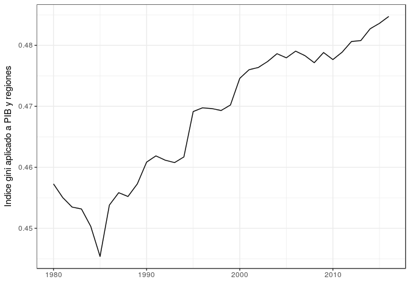
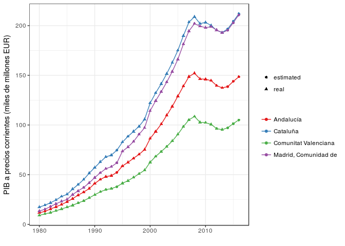
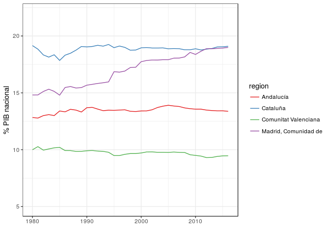
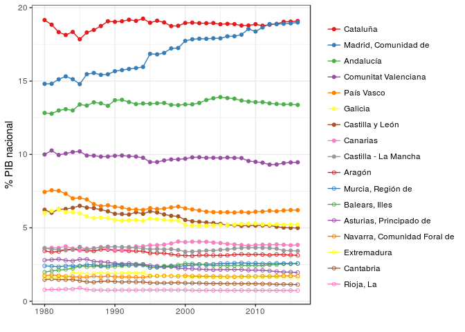
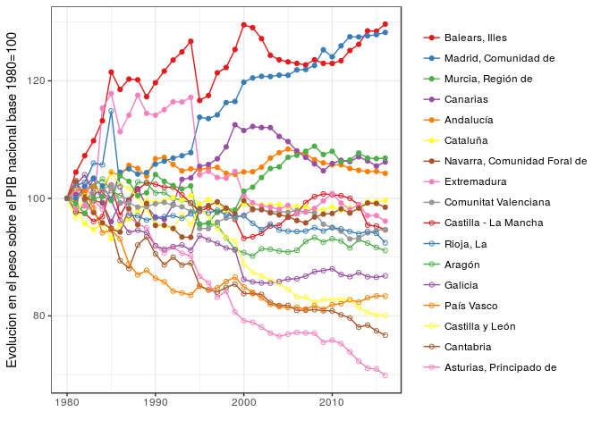
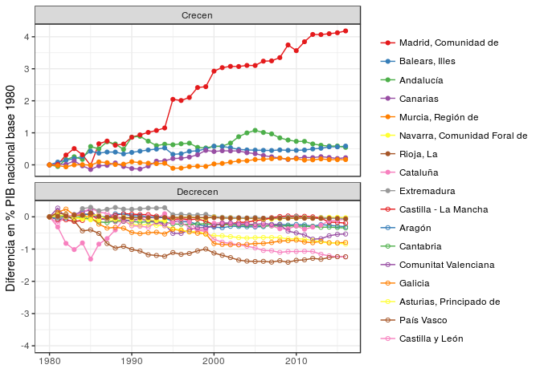

Evolución del PIB por comunidades autónomas durante la democracia. Análisis técnico
================
Carlos Herrera Yagüe
25/3/2018

-   [Objetivos](#objetivos)
-   [Metodología y datos](#metodología-y-datos)
    -   [¿Por qué centrarse en PIB y no en PIB per cápita?](#por-qué-centrarse-en-pib-y-no-en-pib-per-cápita)
-   [Análisis](#análisis)
    -   [Evolución del indice de gini de desigualdad entre comunidades](#evolución-del-indice-de-gini-de-desigualdad-entre-comunidades)
    -   [Evolucion del PIB de las cuatro grandes economías regionales](#evolucion-del-pib-de-las-cuatro-grandes-economías-regionales)
    -   [Evolución comparada de las 17 comunidades autónomas](#evolución-comparada-de-las-17-comunidades-autónomas)

``` r
knitr::opts_chunk$set(echo = TRUE, warning = FALSE)
library(ggplot2)
library(feather)
library(plyr)
library(ineq)
library(RColorBrewer)
library(reshape2)
library(ggthemes)

df.m<-read_feather('gdp_per_region_1980_to_2016.feather')
table <- dcast(df.m, region~year, value.var = 'gdp_current_price')
table[,-1] <-t(t(table[,-1])/colSums(table[,-1]))*100
table_relative.m<-melt(table, id.vars='region')
table_relative.m$year<-as.numeric( as.character(table_relative.m$variable))
```

Objetivos
---------

-   Comprender la evolución de la distribución de actividad económica desde la creación de las CCAA
-   Analizar si la actividad se ha concentrado o distribuido
-   ¿Qué regiones han ganado importancia? ¿Cuáles la han perdido?

Metodología y datos
-------------------

Para hacer el estudio, partimos de las series de PIB autonómicas del Instituto Nacional de Estadística [link](/raw-data). Los datos corresponden a tres series econónomicas distintas por lo que ha habido que consolidarlos manualmente (los nombres de las comunidades no eran consistentes, se utilizaban pesetas y euros, ...). Ese trabajo previo se puede ver [aquí](data-prep.md).

### ¿Por qué centrarse en PIB y no en PIB per cápita?

Todo este análisis está centrado en el Producto Interior Bruto de cada región, concretamente en su evolución a lo largo de los últimos 36 años. Una pregunta razonable es porque nos hemos centrado en el PIB en términos absolutos en lugar de el PIB per cápita. Hay fundamentalmente dos razones.

-   La importancia geopolítica de un territorio está asociada al volumen total de su economía (PIB) en mucho mayor medida que a su nivel de vida (PIB per cápita). Por esta razón, China es más relevante en el panorama internacional que Holanda, pese a tener está última un nivel de vida varias veces mayor a la primera.
-   La personas, a lo largo de su vida, se trasladan en función de las oportunidades que encuentran en el nuevo entorno \[[1](https://arxiv.org/ftp/arxiv/papers/1111/1111.0586.pdf)\]. Sirva el siguiente ejemplo para ilustrar la diferencia entre PIB y PIB per cápita en este sentido. Pongamos que una fábrica cierra en Avilés en 1983, y el estado gasta fuertemente en prejubilaciones que permiten a los antiguos trabajadores conservar, durante el resto de su vida, un nivel de vida muy similar al que tenían cuando estaban activos. Sin embargo, las nuevas generaciones de la zona ya no encuentran oportunidades y se ven obligadas a buscar trabajo fuera de la zona. El PIB per cápita de la zona puede mantenerse constante o incluso subir, pero por la vía de la despoblación, que en un muy buen termómetro de la falta de actividad econónima.

Análisis
--------

### Evolución del indice de gini de desigualdad entre comunidades

Lo primero, comprobamos cual ha sido la evolución de la desigualdad entre comunidades. Observamos una evolución relativemente lenta pero constante a partir de 1985 hacia mayores valores de desigualdad, lo que implica que la actividad econónmica se está concentrando en algunas regiones en lugar en detrimento de otras.

``` r
gini_evol<-data.frame(gini=apply(table[,-1], FUN=ineq, MARGIN=2), 
                      year=as.numeric(names(table[,-1])))

g <- ggplot(gini_evol, aes(x=year,y=gini)) + geom_line() 
g + xlab("") + ylab("Indice gini aplicado a PIB y regiones") + theme_bw()
```



### Evolucion del PIB de las cuatro grandes economías regionales

Observamos la evolución de las cuatro regiones más grandes de nuestra economía. En general vemos los patrones esperados en las cuatro. Crecimiento generalizado hasta el año 2000, muy acelerado de 2000 a 2008 y posteriormente la crisis y la **década perdida**.

Tambien observamos un primera comparación interesante: Desde el año 96 al 2008 Madrid crece más rápido que Cataluña y la segunda está más afectada por la crisis, por lo que parece que en torno a 2011, Madrid alcanza por primera vez a Cataluña en PIB. Nótese que estos datos llegan hasta 2016, por lo que no vemos aún los posibles efectos del los problemas políticos del otoño de 2017, cuando la inestabilidad política provocó que algunas grandes empresas con sede en Cataluña salieran de la comunidad.



Para observar mejor estos efectos, calculamos el peso relativo en PIB de cada region en comparación con el total de la economía nacional.

``` r
big_regions.m<-table_relative.m[table_relative.m$region %in% big_regions$region,]
g<-ggplot(big_regions.m, aes(x=year, y=value, color=region))
g<-g+geom_line()+scale_color_brewer(palette = "Set1")
g<-g+ylab("% PIB nacional")+ylim(5,22)
g<-g+theme(legend.title=element_blank())+xlab("")+theme_bw()
g
```

 El resultado inmediato es que Madrid es la gran ganadora de la etapa democrática, al menos entre las cuatro grandes regiones.

Introduzcamos el resto de comunidades para ver entre ellas hay también algo destacable.

### Evolución comparada de las 17 comunidades autónomas

``` r
small_regions<-table_relative.m #[!table_relative.m$region %in% c("Andalucía","Cataluña","Madrid, Comunidad de", "Comunitat //Valenciana"),]


dd<-small_regions[small_regions$year==2016,]
small_regions$region2<-factor(as.character(small_regions$region), 
                              levels=as.character(dd[with(dd, order(-value)), ]$region))

g<-ggplot(small_regions, aes(x=year, y=value, color=region2,shape=region2))+geom_line()
g<-g+geom_point()+ylab("% PIB nacional")
g<-g+scale_color_manual(values=rep(brewer.pal(name="Set1", n=9),3))
g<-g+scale_shape_manual(values=c(rep(19,9), rep(1,9)))
g<-g+xlab("")+theme_bw()+theme(legend.title=element_blank())
g
```



Ahora podemos confirmar que la importancia relativa de las comunidades se ha mantenido muy estable durante los últimos 36 años. Madrid es la única excepción a esta tendencia. La tendencia que indica el gráfico es que la mayoría de comunidades han perdido algo de su importancia anterior que ha sido capitalizada (nunca mejor dicho) por Madrid.

En la parte inferior del gráfico tenemos una gran cantidad de información de las regiones pequeñas que es complicado distinguir. Para ver más detalle de lo que ocurre con las regiones pequeñas presentemoslas calculando la evolucion contra sí mismas. De esta forma, si una region presentaba un 10% del PIB y ahora representa un 5%, mostramos en el grafico una línea que evoluciona desde 100 hasta 50 (la comunidad ha perdido la mitad de su importancia).

``` r
base_1980_table<-table
base_1980_table[,-1]<-base_1980_table[,-1]/base_1980_table[,2]*100
base_1980_table.m<-melt(base_1980_table,id.vars='region')
base_1980_table.m$year<-as.numeric( as.character(base_1980_table.m$variable))


dd<-base_1980_table.m[base_1980_table.m$year==2016,]
base_1980_table.m$region2<-factor(as.character(base_1980_table.m$region), levels=as.character(dd[with(dd, order(-value)), ]$region))

g<-ggplot(base_1980_table.m, aes(x=year, y=value, color=region2,shape=region2))
g<-g+geom_line()+geom_point()
g<-g+ylab("Evolucion en el peso sobre el PIB nacional base 1980=100")
g<-g+scale_color_manual(values=rep(brewer.pal(name="Set1", n=9),3))
g<-g+scale_shape_manual(values=c(rep(19,9), rep(1,9)))
g<-g+xlab("")+theme_bw()+theme(legend.title=element_blank())
g
```

 Vemos que Madrid, pese a su gran importancia inicial, sigue destacando en evolución relativa. Solo Baleares, una economía mucho más pequeña y a la que posiblemente la entrada en al UE y el euro han supuesto un empujón sin parangón a su sector turístico, presenta una evolución similar.

En el otro extremo de la balanza tenemos las comunidades industriales del norte, en las que interesantemente la pérdida de importancia relativa continúa más allá de la reconversión industrial.

Para terminar en análisis, analizamos la evolución de la ganancia porcentual absoluta de cada comunidad. Para facilitar la comprensión del gráfico, lo dividimos entre las comunidades cuya importancia creció y aquellas cuya importancia decreció.

``` r
base_1980_table<-table
base_1980_table[,-1]<-base_1980_table[,-1]-base_1980_table[,2]
base_1980_table.m<-melt(base_1980_table)
```

    ## Using region as id variables

``` r
base_1980_table.m$year<-as.numeric( as.character(base_1980_table.m$variable))


dd<-base_1980_table.m[base_1980_table.m$year==2016,]
base_1980_table.m$region2<-factor(as.character(base_1980_table.m$region), 
                                  levels=as.character(dd[with(dd, order(-value)), ]$region))

base_1980_table.m$evolution<-"Decrecen"
base_1980_table.m$evolution[as.numeric(base_1980_table.m$region2)<6]<-"Crecen"

dummy_data<-data.frame(year=c(1980,2016), value=c(0, -4), evolution="Decrecen")

g<-ggplot(base_1980_table.m, aes(x=year, y=value))+geom_line(aes(color=region2,shape=region2))
g<-g+geom_point(aes(color=region2,shape=region2))+geom_blank(data=dummy_data,color='black')
g<-g+ylab("Diferencia en % PIB nacional base 1980")
g<-g+scale_color_manual(values=rep(brewer.pal(name="Set1", n=9),3)) 
g<-g+scale_shape_manual(values=c(rep(19,9), rep(1,9)))+xlab("")
g<-g+facet_wrap(~evolution, ncol = 1, scales = "free_y")
g<-g+theme_bw()+theme(legend.title=element_blank())
g
```



Esta figura termina de confirmar los resultados anteriores. La etapa democrática, a nivel económico, se puede resumir es una masiva centralización de la actividad ecónomica en Madrid. Sólo las regiones (Baleares, Andalucía, Canarias y Murcia) donde el turismo tiene una importancia capital presenta saldo positivo, aunque positivo. Las grandes perdedoras son las comunidades industriales, con el País Vasco destacando como la comunidad eque más peso específico ha perdido en el conjunto del Estado.
