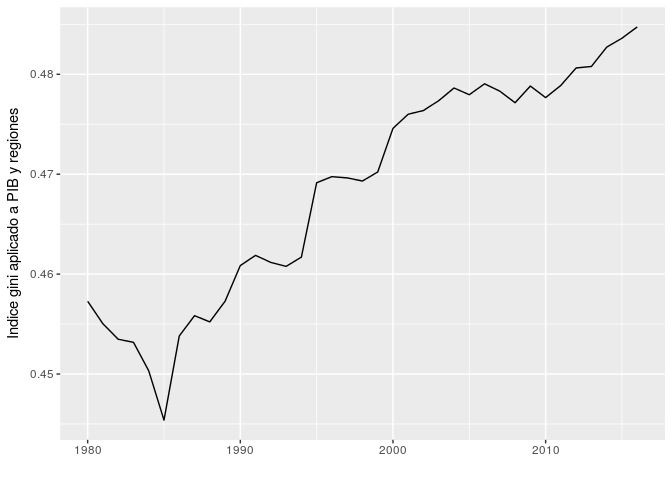
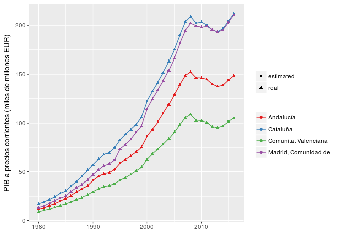
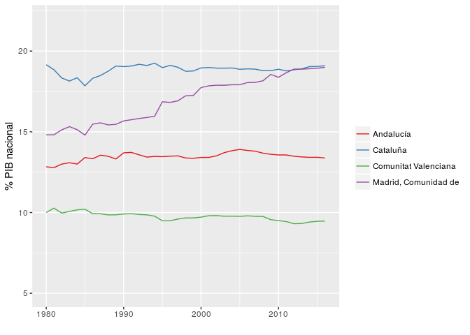
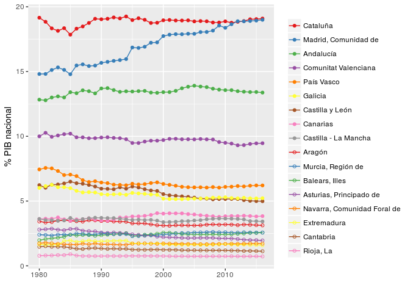
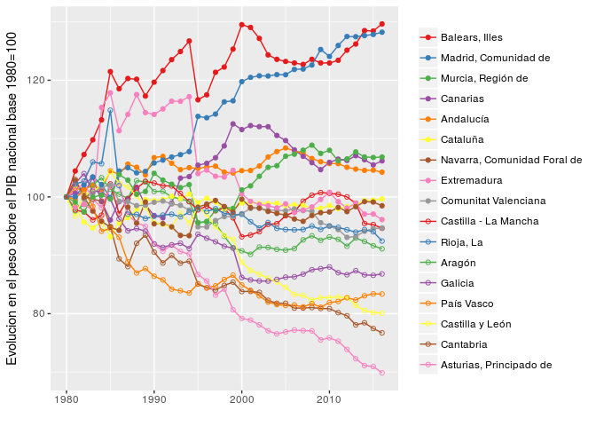
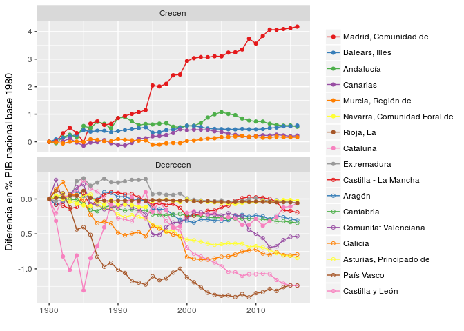

Evolución del PIB por comunidades autónomas durante la democracia
================

Evolución del indice de gini de desigualdad entre comunidades
-------------------------------------------------------------

``` r
gini_evol<-data.frame(gini=apply(table[,-1], FUN=ineq, MARGIN=2), year=as.numeric(names(table[,-1])))

ggplot(gini_evol, aes(x=year,y=gini))+geom_line()+xlab("")+ylab("Indice gini aplicado a PIB y regiones")
```



Evolucion del PIB de las cuatro grandes economías regionales
------------------------------------------------------------

Observamos la evolución de las cuatro regiones más grandes de nuestra economía. En general vemos los patrones esperados en las cuatro. Crecimiento generalizado hasta el año 2000, muy acelerado de 2000 a 2008 y posteriormente la crisis y la *década perdida*.

Tambien observamos un primera comparación interesante: Desde el año 96 al 2008 Madrid crece más rápido que Cataluña y la segunda está más afectada por la crisis, por lo que parece que en torno a 2011, Madrid alcanza por primera vez a Cataluña en PIB.



Para observar estos efectos, calculamos el peso relativo en PIB de cada region en comparación con el total de la economía nacional

``` r
ggplot(table_relative.m[table_relative.m$region %in% c("Andalucía","Cataluña","Madrid, Comunidad de", "Comunitat Valenciana"),], aes(x=year, y=value, color=region))+geom_line()+scale_color_brewer(palette = "Set1")+ylab("% PIB nacional")+ylim(5,22)+theme(legend.title=element_blank())+xlab("")
```



``` r
small_regions<-table_relative.m #[!table_relative.m$region %in% c("Andalucía","Cataluña","Madrid, Comunidad de", "Comunitat //Valenciana"),]


dd<-small_regions[small_regions$year==2016,]
small_regions$region2<-factor(as.character(small_regions$region), levels=as.character(dd[with(dd, order(-value)), ]$region))

ggplot(small_regions, aes(x=year, y=value, color=region2,shape=region2))+geom_line()+geom_point()+ylab("% PIB nacional")+scale_color_manual(values=rep(brewer.pal(name="Set1", n=9),3))+scale_shape_manual(values=c(rep(19,9), rep(1,9)))+theme(legend.title=element_blank())+xlab("")
```



``` r
base_1980_table<-table
base_1980_table[,-1]<-base_1980_table[,-1]/base_1980_table[,2]*100
base_1980_table.m<-melt(base_1980_table,id.vars='region')
base_1980_table.m$year<-as.numeric( as.character(base_1980_table.m$variable))


dd<-base_1980_table.m[base_1980_table.m$year==2016,]
base_1980_table.m$region2<-factor(as.character(base_1980_table.m$region), levels=as.character(dd[with(dd, order(-value)), ]$region))

ggplot(base_1980_table.m, aes(x=year, y=value, color=region2,shape=region2))+geom_line()+geom_point()+ylab("Evolucion en el peso sobre el PIB nacional base 1980=100")+scale_color_manual(values=rep(brewer.pal(name="Set1", n=9),3))+scale_shape_manual(values=c(rep(19,9), rep(1,9)))+theme(legend.title=element_blank())+xlab("")
```



``` r
base_1980_table<-table
base_1980_table[,-1]<-base_1980_table[,-1]-base_1980_table[,2]
base_1980_table.m<-melt(base_1980_table)
```

    ## Using region as id variables

``` r
base_1980_table.m$year<-as.numeric( as.character(base_1980_table.m$variable))


dd<-base_1980_table.m[base_1980_table.m$year==2016,]
base_1980_table.m$region2<-factor(as.character(base_1980_table.m$region), levels=as.character(dd[with(dd, order(-value)), ]$region))

base_1980_table.m$evolution<-"Decrecen"
base_1980_table.m$evolution[as.numeric(base_1980_table.m$region2)<6]<-"Crecen"

ggplot(base_1980_table.m, aes(x=year, y=value, color=region2,shape=region2))+geom_line()+geom_point()+ylab("Diferencia en % PIB nacional base 1980")+scale_color_manual(values=rep(brewer.pal(name="Set1", n=9),3))+scale_shape_manual(values=c(rep(19,9), rep(1,9)))+facet_wrap(~evolution,scales = "free_y",ncol=1)+theme(legend.title=element_blank())+xlab("")
```


